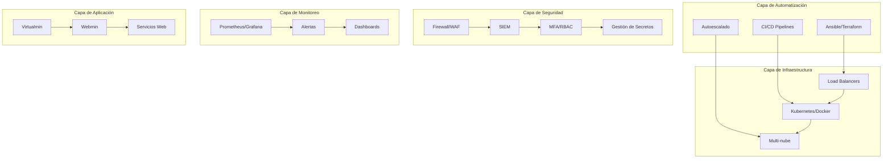
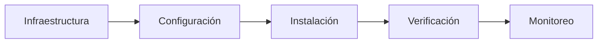
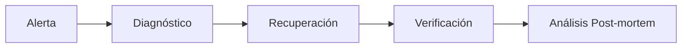

# Plan de Arquitectura de Virtualmin Enterprise

## Visión General

Este documento describe el plan de arquitectura para mejorar el sistema Virtualmin Enterprise con capacidades empresariales avanzadas, enfocándose en automatización, seguridad, monitoreo y resiliencia.

## Arquitectura del Sistema

## Componentes Clave

### 1. Automatización y Orquestación

#### Ansible/Terraform
- **Playbooks de Ansible**: Para configuración, actualización y mantenimiento
- **Scripts de Terraform**: Para provisionamiento de infraestructura
- **Instaladores automáticos**: Scripts one-click para todo el stack

#### Autoescalado y Auto-recuperación
- **Integración con Kubernetes**: Para escalado automático
- **Docker Swarm**: Para orquestación de contenedores
- **Scripts de recuperación**: Para auto-recuperación de servicios

### 2. CI/CD y Validación Continua

#### Pipelines Automatizados
- **GitHub Actions**: Para pruebas y despliegue
- **GitLab CI**: Para integración continua
- **Jenkins**: Para pipelines personalizados

#### Pruebas Automatizadas
- **Pruebas unitarias**: Para componentes individuales
- **Pruebas de integración**: Para interacciones entre componentes
- **Pruebas de carga**: Para evaluar rendimiento
- **Pruebas de resistencia**: Para evaluar resiliencia
- **Pruebas de seguridad**: Para identificar vulnerabilidades

### 3. Seguridad Avanzada y Centralizada

#### Firewall y WAF
- **NGINX como WAF**: Para protección a nivel de aplicación
- **iptables/nftables**: Para firewall a nivel de red
- **Reglas personalizadas**: Para políticas específicas

#### SIEM y Monitoreo de Seguridad
- **Wazuh**: Para SIEM y monitorización de seguridad
- **ELK Stack**: Para centralización de logs
- **Graylog**: Alternativa para gestión de logs

#### Autenticación y Autorización
- **MFA**: Autenticación multifactor
- **RBAC**: Control de acceso basado en roles
- **LDAP/Active Directory**: Para autenticación centralizada

#### Gestión de Secretos
- **HashiCorp Vault**: Para gestión de secretos
- **AWS Secrets Manager**: Para entornos AWS
- **Variables de entorno cifradas**: Para seguridad

### 4. Alta Disponibilidad y Resiliencia

#### Balanceo de Carga
- **NGINX**: Para balanceo de carga HTTP/HTTPS
- **HAProxy**: Para balanceo de carga TCP/HTTP
- **AWS ELB**: Para entornos AWS

#### Clústeres y Microservicios
- **Kubernetes**: Para orquestación de contenedores
- **Docker Swarm**: Alternativa ligera
- **Microservicios**: Para arquitectura escalable

#### Replicación y Failover
- **MySQL Galera Cluster**: Para replicación síncrona
- **MongoDB Replica Set**: para replicación asíncrona
- **Redis Cluster**: Para caché distribuida

#### Backups y Recuperación
- **Backups automáticos**: Programación regular
- **Multi-nube**: Almacenamiento en diferentes proveedores
- **Restauración rápida**: Minimizando tiempo de recuperación

### 5. Monitoreo y Visibilidad en Tiempo Real

#### Métricas y Alertas
- **Prometheus**: Para recolección de métricas
- **Grafana**: Para visualización
- **AlertManager**: Para gestión de alertas

#### Integración con Sistemas de Tickets
- **Slack**: Para notificaciones en tiempo real
- **PagerDuty**: Para escalado de alertas
- **Email**: Para notificaciones tradicionales

#### Reportes Automáticos
- **Estado del sistema**: Informes de salud
- **Seguridad**: Informes de seguridad
- **Rendimiento**: Informes de rendimiento

### 6. Optimización de Rendimiento

#### Cachés y CDN
- **Redis**: Para caché en memoria
- **Memcached**: Alternativa ligera
- **CDN**: Para aceleración de contenido estático

#### Tuning de Sistema
- **sysctl**: Para optimización del kernel
- **TCP tuning**: Para optimización de red
- **Limites de recursos**: Para evitar agotamiento

#### Despliegue Multi-región
- **Balanceo geográfico**: Para distribución global
- **CDN**: Para contenido cercano al usuario
- **Replicación geográfica**: Para alta disponibilidad

### 7. Documentación y Experiencia de Usuario

#### Documentación Centralizada
- **README**: Información general
- **Guías**: Instrucciones paso a paso
- **Diagramas**: Visualización de arquitectura

#### Asistentes Interactivos
- **Scripts de autodiagnóstico**: Para identificación de problemas
- **Asistente interactivo**: Para ayuda guiada
- **Panel de control**: Para gestión centralizada

### 8. Pruebas y Auditoría

#### Pruebas de Carga y Estrés
- **JMeter**: Para pruebas de carga
- **Locust**: Para pruebas de carga distribuidas
- **Chaos Monkey**: Para simulación de fallos

#### Auditorías de Seguridad
- **Pentesting**: Para pruebas de penetración
- **Escaneo de vulnerabilidades**: Para identificar debilidades
- **Auditorías regulares**: Para cumplimiento

### 9. Gestión de Recursos y Costos

#### Monitoreo de Recursos
- **Dashboards de costos**: Para visualización
- **Alertas de presupuesto**: Para control de gastos
- **Optimización automática**: Para reducción de costos

### 10. Soporte y Escalabilidad

#### Arquitectura Modular
- **Microservicios**: Para escalabilidad independiente
- **APIs**: Para integración externa
- **Contenedores**: Para portabilidad

## Flujo de Trabajo

### 1. Despliegue Inicial

### 2. Actualización Continua

### 3. Respuesta a Incidentes

## Implementación

### Fase 1: Fundamentos (1-2 semanas)
1. Configurar infraestructura básica
2. Implementar CI/CD básico
3. Configurar monitoreo básico

### Fase 2: Seguridad (2-3 semanas)
1. Implementar firewall y WAF
2. Configurar SIEM
3. Implementar MFA y RBAC

### Fase 3: Alta Disponibilidad (2-3 semanas)
1. Configurar balanceadores de carga
2. Implementar clústeres
3. Configurar replicación y failover

### Fase 4: Optimización (1-2 semanas)
1. Implementar cachés
2. Optimizar sistema operativo
3. Configurar despliegue multi-región

### Fase 5: Documentación (1 semana)
1. Crear documentación
2. Implementar asistentes interactivos
3. Crear panel de control

## Métricas de Éxito

### Técnicas
- **Uptime**: 99.99%
- **Tiempo de recuperación**: < 5 minutos
- **Tiempo de despliegue**: < 15 minutos

### de Negocio
- **Reducción de costos**: 20-30%
- **Mejora de rendimiento**: 40-50%
- **Reducción de incidentes**: 60-70%

## Riesgos y Mitigación

### Riesgos Técnicos
- **Complejidad**: Mitigado con documentación y asistentes
- **Compatibilidad**: Mitigado con pruebas exhaustivas
- **Seguridad**: Mitigado con auditorías regulares

### Riesgos Operacionales
- **Capacitación**: Mitigado con documentación clara
- **Adopción**: Mitigado con beneficios visibles
- **Mantenimiento**: Mitigado con automatización

## Conclusión

Este plan de arquitectura proporciona una base sólida para mejorar el sistema Virtualmin Enterprise con capacidades empresariales avanzadas. La implementación gradual permite minimizar riesgos mientras se maximizan los beneficios.