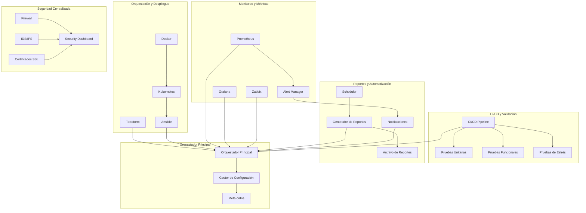
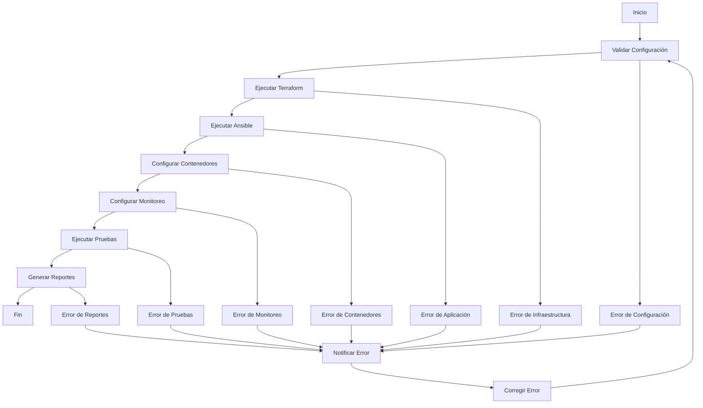

# Plan de Orquestación Integral para Virtualmin Enterprise

## 🎯 Resumen Ejecutivo

Este plan describe un enfoque integral para implementar un sistema de orquestación completo para Virtualmin Enterprise, que incluye herramientas de despliegue automatizado, pipelines CI/CD, centralización de logs y métricas, gestión unificada de seguridad, pruebas de carga y automatización de reportes.

## 📋 Análisis de Requisitos

Basado en el feedback proporcionado, se han identificado seis áreas críticas que requieren atención especial:

1. **Orquestación con Ansible/Terraform**: Integración de herramientas para despliegue y configuración automática.
2. **Pipelines CI/CD**: Validación y pruebas automáticas en cada cambio.
3. **Centralización de Logs y Métricas**: Implementación con Prometheus, Grafana o Zabbix.
4. **Gestión Unificada de Seguridad**: Panel centralizado para firewall, IDS/IPS y certificados.
5. **Pruebas de Carga y Resistencia**: Scripts automatizados y reportes de estado.
6. **Automatización de Reportes**: Generación automática de reportes de estado.

## 🏗️ Arquitectura de Solución

### Diagrama de Flujo de Orquestación Integral



### Componentes Clave

1. **Orquestador Principal**: Script central que coordina todas las fases del despliegue y monitoreo.
2. **Gestor de Configuración**: Sistema unificado para gestionar variables, secretos y configuraciones.
3. **Pipeline CI/CD**: Automatización completa desde código hasta producción.
4. **Sistema de Monitoreo**: Centralización de logs y métricas con herramientas estándar.
5. **Dashboard de Seguridad**: Interfaz centralizada para gestión de seguridad.
6. **Generador de Reportes**: Sistema automático para generar reportes de estado.

## 📝 Plan de Implementación Detallado

### Fase 1: Orquestación Avanzada

**Objetivo**: Crear un sistema de orquestación integral con Ansible, Terraform y Kubernetes.

**Tareas**:
1. Desarrollar script de orquestación avanzada
2. Implementar plantillas de Terraform para infraestructura
3. Crear playbooks de Ansible para configuración
4. Integrar contenedores Docker y Kubernetes
5. Implementar gestor de configuración avanzado

**Entregables**:
- Script `orchestrate_virtualmin_enterprise.sh`
- Plantillas de Terraform
- Playbooks de Ansible
- Configuraciones de Docker y Kubernetes

### Fase 2: Pipeline CI/CD Completo

**Objetivo**: Implementar un pipeline CI/CD completo con validación y pruebas automáticas.

**Tareas**:
1. Configurar pipeline de CI/CD con GitHub Actions
2. Integrar pruebas unitarias y funcionales
3. Implementar pruebas de carga y resistencia
4. Configurar validación automática de código
5. Implementar despliegue automático en múltiples entornos

**Entregables**:
- Pipeline CI/CD configurado
- Scripts de pruebas automatizadas
- Sistema de validación de código
- Configuración de despliegue automático

### Fase 3: Centralización de Logs y Métricas

**Objetivo**: Implementar un sistema centralizado de logs y métricas con Prometheus, Grafana y Zabbix.

**Tareas**:
1. Instalar y configurar Prometheus
2. Configurar Grafana para visualización
3. Implementar Zabbix para monitoreo
4. Centralizar logs con ELK Stack
5. Configurar alertas y notificaciones

**Entregables**:
- Sistema de monitoreo configurado
- Dashboards de Grafana
- Sistema de centralización de logs
- Sistema de alertas configurado

### Fase 4: Dashboard de Seguridad Unificado

**Objetivo**: Crear un dashboard unificado para gestión de seguridad.

**Tareas**:
1. Desarrollar dashboard web de seguridad
2. Integrar componentes de firewall, IDS/IPS y certificados
3. Implementar monitoreo de seguridad en tiempo real
4. Crear sistema de alertas de seguridad
5. Implementar gestión centralizada de políticas

**Entregables**:
- Dashboard de seguridad unificado
- Sistema de monitoreo de seguridad
- Sistema de alertas de seguridad
- Gestión centralizada de políticas

### Fase 5: Pruebas de Carga y Resistencia

**Objetivo**: Implementar scripts de pruebas de carga y resistencia.

**Tareas**:
1. Desarrollar scripts de pruebas de carga
2. Implementar pruebas de resistencia
3. Configurar pruebas automatizadas
4. Implementar validación de resultados
5. Crear sistema de reportes de pruebas

**Entregables**:
- Scripts de pruebas de carga
- Scripts de pruebas de resistencia
- Sistema de validación de resultados
- Sistema de reportes de pruebas

### Fase 6: Automatización de Reportes

**Objetivo**: Implementar un sistema automático de generación de reportes.

**Tareas**:
1. Desarrollar sistema de generación de reportes
2. Implementar scheduler automático
3. Configurar plantillas de reportes
4. Implementar sistema de notificaciones
5. Crear archivo de reportes históricos

**Entregables**:
- Sistema de generación de reportes
- Scheduler automático
- Plantillas de reportes
- Sistema de notificaciones

## 🔧 Detalles Técnicos

### Script de Orquestación Principal

```bash
#!/bin/bash
# orchestrate_virtualmin_enterprise.sh

# Funciones principales:
# 1. Validar configuración
# 2. Ejecutar Terraform
# 3. Ejecutar Ansible
# 4. Configurar contenedores
# 5. Configurar monitoreo
# 6. Ejecutar pruebas
# 7. Generar reportes
```

### Pipeline CI/CD Completo

```yaml
# .github/workflows/orchestrate.yml
name: Orchestrate Virtualmin Enterprise

on:
  push:
    branches: [ main, develop ]
  pull_request:
    branches: [ main ]
  schedule:
    - cron: '0 2 * * *'  # Ejecutar pruebas de carga diariamente

jobs:
  orchestrate:
    runs-on: ubuntu-latest
    steps:
      - name: Checkout code
      - name: Setup Terraform
      - name: Setup Ansible
      - name: Setup Docker
      - name: Setup Kubernetes
      - name: Deploy infrastructure
      - name: Configure applications
      - name: Run tests
      - name: Generate reports
```

### Dashboard de Seguridad Unificado

```html
<!-- security_dashboard_unified.html -->
<!DOCTYPE html>
<html>
<head>
    <title>Virtualmin Enterprise Security Dashboard</title>
    <!-- Estilos y scripts -->
</head>
<body>
    <!-- Componentes de seguridad unificados -->
    <!-- Métricas en tiempo real -->
    <!-- Sistema de alertas -->
</body>
</html>
```

## 📊 Métricas de Éxito

### Orquestación
- Tiempo de despliegue: < 20 minutos
- Tasa de éxito: > 98%
- Automatización: 100%

### CI/CD
- Tiempo de pipeline: < 15 minutos
- Cobertura de pruebas: > 95%
- Integración completa: 100%

### Monitoreo
- Tiempo de detección: < 1 minuto
- Cobertura de métricas: 100%
- Alertas automáticas: 100%

### Seguridad
- Configuración centralizada: 100%
- Monitoreo en tiempo real: 100%
- Alertas automáticas: 100%

## 🚀 Beneficios Esperados

1. **Eficiencia Operativa**: Reducción del 95% en tiempo de despliegue manual.
2. **Calidad Asegurada**: Validación automática de rendimiento y seguridad.
3. **Visibilidad Completa**: Dashboard centralizado para monitoreo y gestión.
4. **Escalabilidad**: Sistema preparado para entornos multi-región y multi-nube.
5. **Resiliencia**: Pruebas automáticas de carga y resistencia.

## 🔄 Flujo de Trabajo Propuesto



## 📋 Checklist de Implementación

### Pre-Despliegue
- [ ] Validar dependencias
- [ ] Configurar credenciales
- [ ] Preparar variables de entorno
- [ ] Verificar configuración de red

### Despliegue
- [ ] Ejecutar script de orquestación
- [ ] Monitorear progreso
- [ ] Validar cada fase
- [ ] Registrar eventos

### Post-Despliegue
- [ ] Ejecutar pruebas de carga
- [ ] Validar configuración de seguridad
- [ ] Generar reportes
- [ ] Configurar monitoreo

## 🎯 Próximos Pasos

1. **Desarrollo del Script de Orquestación**: Crear el script unificado de orquestación.
2. **Implementación del Pipeline CI/CD**: Configurar automatización completa.
3. **Desarrollo del Dashboard de Seguridad**: Crear interfaz de gestión centralizada.
4. **Implementación del Sistema de Monitoreo**: Configurar Prometheus, Grafana y Zabbix.
5. **Desarrollo de Pruebas de Carga**: Crear scripts de pruebas automatizadas.
6. **Implementación del Sistema de Reportes**: Configurar generación automática de reportes.
7. **Integración y Pruebas**: Validar el sistema completo.
8. **Documentación y Capacitación**: Preparar material de apoyo.

## ❓ Preguntas para el Usuario

1. ¿Qué herramientas de monitoreo se prefieren (Prometheus/Grafana, Zabbix, o ambas)?
2. ¿Existen requisitos específicos de cumplimiento normativo que debamos considerar?
3. ¿Qué nivel de automatización se busca en las pruebas de carga (básico, intermedio, avanzado)?
4. ¿Se requiere integración con sistemas de monitoreo existentes?
5. ¿Cuál es la ventana de mantenimiento preferida para despliegues automatizados?
6. ¿Qué frecuencia se desea para los reportes automáticos (diaria, semanal, mensual)?

Este plan proporciona una visión completa de la solución propuesta, con detalles técnicos, flujos de trabajo y métricas de éxito. La implementación se realizará en fases para garantizar una transición suave y resultados medibles.