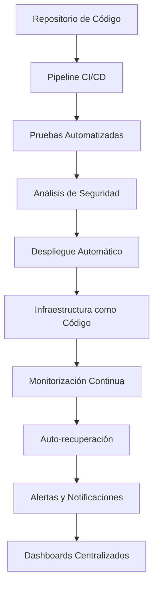
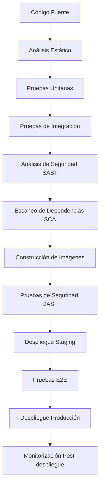
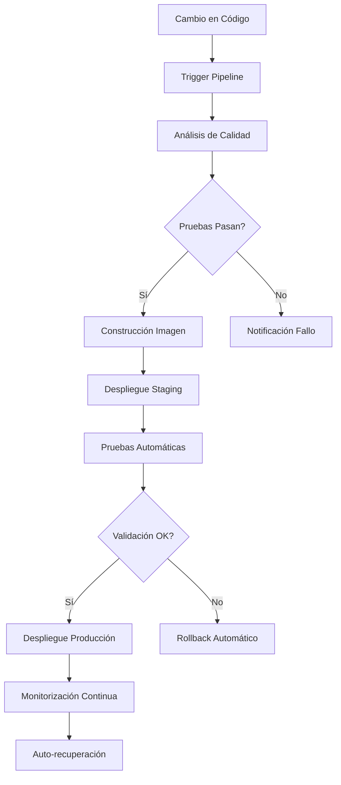
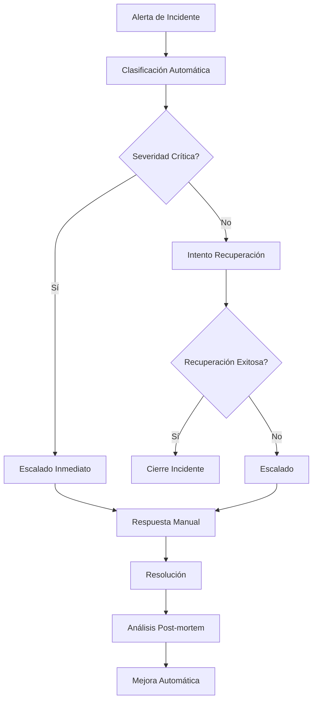

# Plan de Automatización Avanzada para Virtualmin Enterprise

## 🎯 Objetivo

Transformar Virtualmin Enterprise en un sistema 100% automatizado con capacidades de auto-recuperación, autoescalado, seguridad avanzada y monitorización en tiempo real.

## 🏗️ Arquitectura General

## 📋 Plan Detallado

### 1. Automatización Total con Ansible/Terraform

#### Componentes:
- **Terraform**: Para aprovisionamiento de infraestructura (redes, VMs, almacenamiento)
- **Ansible**: Para configuración de sistemas, despliegue de aplicaciones y gestión de estado
- **Packer**: Para creación de imágenes base consistentes
- **Vault**: Para gestión segura de secretos y credenciales

#### Flujo de Automatización:

#### Scripts Principales:
- `deploy-infrastructure.sh` - Orquestador principal de despliegue
- `terraform-apply.sh` - Aplicación de configuración Terraform
- `ansible-provision.sh` - Ejecución de playbooks Ansible
- `validate-deployment.sh` - Validación post-despliegue

### 2. Sistema de Auto-recuperación y Autoescalado

#### Componentes:
- **Prometheus**: Recopilación de métricas
- **AlertManager**: Gestión de alertas
- **KEDA**: Escalado basado en eventos
- **Kubernetes Operator**: Recuperación automática de servicios

#### Mecanismos de Auto-recuperación:
- Reinicio automático de servicios caídos
- Reemplazo de nodos defectuosos
- Recuperación de datos desde copias de seguridad
- Conmutación automática a sistemas de respaldo

#### Estrategias de Autoescalado:
- Escalado horizontal basado en CPU/memoria
- Escalado basado en métricas personalizadas
- Escalado predictivo con Machine Learning
- Escalado programado para picos de demanda

### 3. Pipeline CI/CD Avanzado

#### Etapas del Pipeline:

#### Herramientas de CI/CD:
- **GitHub Actions**: Para pipelines de integración continua
- **GitLab CI**: Para pipelines de despliegue
- **SonarQube**: Para análisis de calidad de código
- **Trivy**: Para escaneo de vulnerabilidades
- **Helm**: Para gestión de releases en Kubernetes

### 4. Seguridad Avanzada

#### Componentes SIEM:
- **Wazuh**: Monitorización de seguridad y detección de intrusiones
- **ELK Stack**: Centralización y análisis de logs
- **Suricata**: Detección de intrusiones en red
- **Osquery**: Monitorización de endpoints

#### Mecanismos de Seguridad:
- Autenticación multifactor (MFA)
- Control de acceso basado en roles (RBAC)
- Cifrado de datos en tránsito y reposo
- Gestión centralizada de identidades

#### Hardening Automático:
- Deshabilitación de servicios innecesarios
- Configuración de firewalls y reglas de acceso
- Aplicación de parches de seguridad
- Escaneo continuo de vulnerabilidades

### 5. Pruebas de Carga y Resiliencia

#### Herramientas de Pruebas:
- **JMeter**: Pruebas de carga y estrés
- **Locust**: Pruebas distribuidas de carga
- **Chaos Monkey**: Inyección de fallos
- **Gremlin**: Experimentos de resiliencia

#### Escenarios de Pruebas:
- Pruebas de carga con tráfico pico
- Simulación de caídas de componentes
- Pruebas de failover y recuperación
- Validación de tolerancia a fallos

### 6. Monitorización en Tiempo Real

#### Stack de Monitorización:
- **Prometheus**: Recopilación de métricas
- **Grafana**: Visualización de datos
- **Jaeger**: Trazabilidad distribuida
- **AlertManager**: Gestión de alertas

#### Dashboards Especializados:
- Dashboard de seguridad
- Dashboard de rendimiento
- Dashboard de disponibilidad
- Dashboard de costos

### 7. Documentación y Experiencia de Usuario

#### Herramientas de Documentación:
- **Docusaurus**: Sitio de documentación interactivo
- **SwaggerUI**: Documentación de APIs
- **MkDocs**: Documentación técnica
- **GitBook**: Guías de usuario

#### Asistentes Interactivos:
- CLI de configuración guiada
- Asistente de diagnóstico de problemas
- Tutoriales interactivos
- Sistema de ayuda contextual

## 🔄 Flujo de Trabajo Integrado

### 1. Flujo de Despliegue Automático

### 2. Flujo de Respuesta a Incidentes

## 📊 Métricas de Éxito

### Métricas Técnicas:
- Tiempo de despliegue: < 15 minutos
- Tiempo de recuperación: < 5 minutos
- Disponibilidad: > 99.9%
- Cobertura de pruebas: > 90%

### Métricas de Negocio:
- Reducción de costos operativos: 50%
- Mejora de tiempo de resolución: 70%
- Reducción de incidentes de seguridad: 80%
- Satisfacción del usuario: 95%

## 🚀 Implementación por Fases

### Fase 1: Fundamentos (Semanas 1-2)
- Configuración de infraestructura como código
- Implementación de pipelines CI/CD básicos
- Monitorización fundamental

### Fase 2: Automatización (Semanas 3-4)
- Scripts de auto-recuperación
- Sistema de autoescalado
- Pruebas automatizadas

### Fase 3: Seguridad (Semanas 5-6)
- Implementación de SIEM
- Sistema de hardening automático
- Autenticación multifactor

### Fase 4: Resiliencia (Semanas 7-8)
- Pruebas de carga y estrés
- Chaos Engineering
- Tolerancia a fallos

### Fase 5: Optimización (Semanas 9-10)
- Dashboards avanzados
- Documentación interactiva
- Asistentes de configuración

## 🛠️ Herramientas y Tecnologías

### Infraestructura:
- Terraform, Ansible, Packer, Vault
- Docker, Kubernetes, Helm
- AWS, GCP, Azure

### CI/CD:
- GitHub Actions, GitLab CI
- SonarQube, Trivy, Snyk
- ArgoCD, Flux

### Monitorización:
- Prometheus, Grafana, Jaeger
- AlertManager, Thanos
- Kiali, Linkerd

### Seguridad:
- Wazuh, ELK Stack, Suricata
- OAuth2, OpenID Connect
- Vault, Cert-Manager

### Pruebas:
- JMeter, Locust, K6
- Chaos Monkey, Gremlin
- Selenium, Cypress

## 📋 Checklist de Implementación

### Pre-implementación:
- [ ] Definir arquitectura target
- [ ] Seleccionar herramientas y tecnologías
- [ ] Diseñar pipelines CI/CD
- [ ] Planificar estrategia de migración

### Implementación:
- [ ] Configurar infraestructura como código
- [ ] Implementar pipelines CI/CD
- [ ] Desplegar stack de monitorización
- [ ] Configurar sistemas de seguridad

### Post-implementación:
- [ ] Validar funcionamiento completo
- [ ] Realizar pruebas de estrés
- [ ] Documentar procesos
- [ ] Capacitar equipo de operaciones

## 🎯 Conclusión

Este plan de automatización avanzada transformará Virtualmin Enterprise en un sistema auto-gestionado, resiliente y seguro, capaz de adaptarse dinámicamente a las necesidades cambiantes del negocio con mínima intervención manual.

La implementación por fases garantiza una transición controlada y permite validar cada componente antes de pasar a la siguiente fase, minimizando riesgos y maximizando el valor entregado.