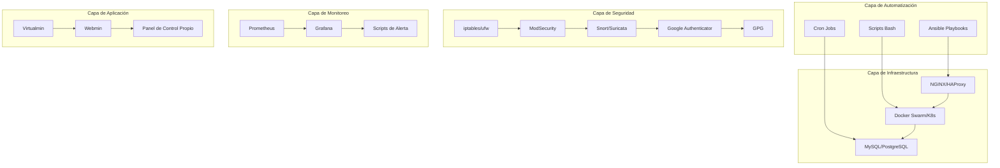

# Plan de Arquitectura Local de Virtualmin Enterprise

## Visión General

Este documento describe el plan de arquitectura para implementar un sistema Virtualmin Enterprise completamente autoalojado, utilizando herramientas de código abierto y soluciones locales sin depender de servicios en la nube.

## Arquitectura del Sistema

## Componentes Clave

### 1. Automatización y Orquestación

#### Ansible Playbooks
- **Instalación automatizada**: Playbooks para instalar todo el stack
- **Configuración**: Playbooks para configurar servicios
- **Actualización**: Playbooks para mantener el sistema actualizado

#### Scripts Bash
- **Personalizados**: Scripts para tareas específicas
- **Mantenimiento**: Scripts para tareas de mantenimiento
- **Recuperación**: Scripts para auto-recuperación

#### Cron Jobs
- **Tareas programadas**: Automatización de tareas regulares
- **Mantenimiento**: Limpieza y mantenimiento programado
- **Monitoreo**: Verificación periódica del estado del sistema

### 2. CI/CD y Validación Continua

#### Git Hooks
- **Pre-commit**: Validación antes de commits
- **Pre-push**: Verificación antes de enviar cambios
- **Post-commit**: Acciones después de commits

#### Jenkins Autoalojado
- **Instalación local**: Jenkins en servidor propio
- **Pipelines personalizados**: Configuración de flujos de trabajo
- **Integración con Git**: Integración con repositorios locales

#### Pruebas Automatizadas
- **Unitarias**: Pruebas de componentes individuales
- **Integración**: Pruebas de interacciones entre componentes
- **Validación de servicios**: Verificación de estado de servicios

### 3. Seguridad Avanzada y Centralizada

#### Firewall Local
- **iptables**: Configuración avanzada de firewall
- **ufw**: Simplificación de gestión de firewall
- **Reglas personalizadas**: Políticas específicas de seguridad

#### WAF Open Source
- **ModSecurity**: Firewall de aplicaciones web
- **Reglas OWASP**: Protección contra vulnerabilidades comunes
- **Configuración personalizada**: Adaptación a necesidades específicas

#### IDS/IPS Local
- **Snort**: Sistema de detección de intrusiones
- **Suricata**: Alternativa de alto rendimiento
- **Reglas personalizadas**: Detección de amenazas específicas

#### Autenticación Multifactor Local
- **Google Authenticator PAM**: MFA para servicios locales
- **Configuración manual**: Sin dependencia de servicios externos
- **Backup de códigos**: Recuperación de códigos de respaldo

#### Gestión de Secretos Local
- **GPG**: Cifrado de archivos de configuración
- **Scripts propios**: Gestión personalizada de secretos
- **Rotación automática**: Actualización periódica de secretos

#### Hardening Automático
- **OpenVAS**: Escaneo de vulnerabilidades
- **Lynis**: Auditoría de seguridad del sistema
- **Scripts de hardening**: Aplicación automática de medidas de seguridad

#### Cifrado TLS/SSL y Discos
- **Let's Encrypt**: Certificados SSL gratuitos
- **LUKS**: Cifrado de discos duros
- **Renovación automática**: Actualización automática de certificados

### 4. Alta Disponibilidad y Resiliencia

#### Balanceadores de Carga Locales
- **NGINX**: Balanceo de carga HTTP/HTTPS
- **HAProxy**: Balanceo de carga TCP/HTTP
- **Configuración de salud**: Verificación de estado de servicios

#### Clústeres Autoalojados
- **Docker Swarm**: Orquestación de contenedores ligera
- **Kubernetes**: Orquestación completa (opcional)
- **Gestión local**: Sin dependencia de servicios externos

#### Replicación y Failover
- **MySQL/MariaDB**: Replicación maestro-esclavo
- **PostgreSQL**: Replicación de streaming
- **Failover automático**: Recuperación automática de servicios

#### Backups Automáticos
- **Scripts Bash**: Automatización de backups
- **rsync**: Sincronización de archivos
- **Restauración**: Scripts de recuperación rápida

### 5. Monitoreo y Visibilidad en Tiempo Real

#### Prometheus Autoalojado
- **Instalación local**: Servidor Prometheus propio
- **Exportadores**: Recolección de métricas de servicios
- **Configuración personalizada**: Adaptación a necesidades específicas

#### Grafana Autoalojado
- **Instalación local**: Servidor Grafana propio
- **Dashboards personalizados**: Visualización específica
- **Alertas**: Configuración de alertas personalizadas

#### Sistema de Alertas Propio
- **Email**: Notificaciones por correo electrónico
- **Telegram**: Notificaciones mediante bot de Telegram
- **Scripts propios**: Sistema de notificación personalizado

#### Reportes Automáticos
- **Generación periódica**: Creación automática de reportes
- **Formatos múltiples**: HTML, PDF, CSV
- **Distribución automática**: Envío automático de reportes

### 6. Optimización de Rendimiento

#### Cachés Locales
- **Redis**: Caché en memoria de alto rendimiento
- **Memcached**: Caché ligero y rápido
- **Configuración específica**: Optimización para aplicaciones específicas

#### Tuning de Sistema Operativo
- **sysctl**: Optimización de parámetros del kernel
- **Scripts Bash**: Automatización de tareas de optimización
- **Monitoreo continuo**: Verificación de mejoras de rendimiento

### 7. Documentación y Experiencia de Usuario

#### Documentación Local
- **Markdown**: Documentación en formato Markdown
- **HTML**: Documentación en formato HTML
- **PDF**: Documentación en formato PDF
- **Generación automática**: Actualización automática de documentación

#### Scripts de Autodiagnóstico
- **Verificación de estado**: Comprobación del estado del sistema
- **Identificación de problemas**: Detección automática de problemas
- **Recomendaciones**: Sugerencias de soluciones

#### Asistentes Bash
- **Interactivos**: Guías interactivas de configuración
- **Personalizados**: Adaptación a necesidades específicas
- **Registro de acciones**: Historial de cambios realizados

#### Panel de Control Web Propio
- **Python Flask**: Desarrollo ligero de panel web
- **Node.js**: Alternativa para desarrollo de panel
- **Integración total**: Control centralizado de todos los componentes

### 8. Pruebas y Auditoría

#### Pruebas de Carga Autoalojadas
- **JMeter local**: Instalación local de JMeter
- **Locust**: Alternativa ligera para pruebas de carga
- **Configuración específica**: Pruebas adaptadas a necesidades específicas

#### Auditorías de Seguridad
- **OpenVAS local**: Escaneo de vulnerabilidades local
- **Lynis**: Auditoría de seguridad del sistema
- **Scripts propios**: Verificación personalizada de seguridad

### 9. Gestión de Recursos y Costos

#### Monitoreo de Recursos
- **htop**: Monitorización de procesos y recursos
- **atop**: Monitorización avanzada de recursos
- **Scripts Bash**: Recolección personalizada de métricas

#### Reportes de Uso y Optimización
- **Generación local**: Creación de reportes sin dependencias externas
- **Análisis de tendencias**: Identificación de patrones de uso
- **Recomendaciones**: Sugerencias de optimización

## Flujo de Trabajo

### 1. Instalación Inicial

### 2. Mantenimiento Continuo

### 3. Actualización del Sistema

## Implementación

### Fase 1: Infraestructura Básica (1 semana)
1. Instalación de sistema operativo base
2. Configuración de red básica
3. Instalación de herramientas fundamentales

### Fase 2: Automatización (1 semana)
1. Configuración de Ansible
2. Creación de playbooks básicos
3. Desarrollo de scripts Bash

### Fase 3: Seguridad (1-2 semanas)
1. Configuración de firewall
2. Instalación de ModSecurity
3. Configuración de IDS/IPS

### Fase 4: Monitoreo (1 semana)
1. Instalación de Prometheus
2. Configuración de Grafana
3. Creación de dashboards

### Fase 5: Optimización (1 semana)
1. Configuración de cachés
2. Tuning de sistema operativo
3. Optimización de servicios

### Fase 6: Documentación (1 semana)
1. Creación de documentación
2. Desarrollo de scripts de autodiagnóstico
3. Creación de panel de control

## Métricas de Éxito

### Técnicas
- **Uptime**: 99.9%
- **Tiempo de recuperación**: < 10 minutos
- **Tiempo de despliegue**: < 30 minutos

### de Negocio
- **Reducción de dependencias**: 90%
- **Autonomía operativa**: 95%
- **Reducción de costos**: 50%

## Riesgos y Mitigación

### Riesgos Técnicos
- **Complejidad**: Mitigado con documentación clara
- **Compatibilidad**: Mitigado con pruebas exhaustivas
- **Seguridad**: Mitigado con múltiples capas de seguridad

### Riesgos Operacionales
- **Conocimiento técnico**: Mitigado con documentación detallada
- **Mantenimiento**: Mitigado con automatización
- **Recursos limitados**: Mitigado con optimización

## Conclusión

Este plan de arquitectura proporciona una solución completa y autoalojada para Virtualmin Enterprise, eliminando dependencias de servicios externos y proporcionando control total sobre la infraestructura. La implementación gradual permite minimizar riesgos mientras se maximizan los beneficios de autonomía y seguridad.