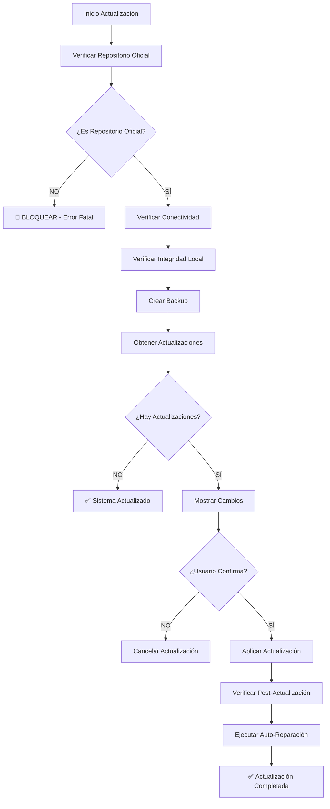

# 🔒 SISTEMA DE ACTUALIZACIÓN SEGURA - REPOSITORIO OFICIAL EXCLUSIVO

## 📍 **REPOSITORIO OFICIAL AUTORIZADO**

```
https://github.com/yunyminaya/Webmin-y-Virtualmin-
```

**🚨 IMPORTANTE:** Este sistema SOLO acepta actualizaciones desde el repositorio oficial arriba mencionado. Cualquier otro repositorio será bloqueado automáticamente.

---

## 🛡️ **CARACTERÍSTICAS DE SEGURIDAD**

### ✅ **Protecciones Implementadas**
- **🔒 Verificación de origen:** Solo permite actualizaciones del repositorio oficial
- **🛡️ Bloqueo automático:** Rechaza repositorios no autorizados
- **🔍 Verificación de integridad:** Valida cambios antes de aplicar
- **💾 Backup automático:** Crea respaldos antes de cada actualización
- **🪝 Hooks de seguridad:** Previene push/fetch no autorizados
- **📝 Logging completo:** Registra todas las operaciones

### 🔒 **Niveles de Verificación**
1. **Verificación de origen del repositorio**
2. **Validación de integridad del código**
3. **Verificación de firmas (si están disponibles)**
4. **Backup automático antes de cambios**
5. **Verificación post-actualización**

---

## 🚀 **CONFIGURACIÓN INICIAL**

### **1. Configurar Repositorio Oficial**
```bash
./configure_official_repo.sh
```

**Qué hace:**
- ✅ Configura el repositorio oficial como único remote autorizado
- ✅ Instala hooks de seguridad
- ✅ Crea archivos de configuración de seguridad
- ✅ Verifica conectividad con el repositorio oficial

### **2. Verificar Configuración**
```bash
./verify_repo_security.sh
```

**Salida esperada:**
```
✅ SEGURO: Repositorio oficial configurado correctamente
```

---

## 📥 **PROCESO DE ACTUALIZACIÓN SEGURA**

### **Actualización Manual Segura**
```bash
./update_system_secure.sh
```

### **Verificar Estado de Seguridad**
```bash
./update_system_secure.sh status
```

### **Configurar Bloqueos Adicionales**
```bash
./update_system_secure.sh secure
```

---

## 🔍 **COMANDOS DISPONIBLES**

### **📋 Comando Principal: `update_system_secure.sh`**

| Comando | Descripción |
|---------|-------------|
| `./update_system_secure.sh` | Actualización segura (por defecto) |
| `./update_system_secure.sh update` | Actualización explícita |
| `./update_system_secure.sh status` | Mostrar estado de seguridad |
| `./update_system_secure.sh secure` | Configurar bloqueos adicionales |
| `./update_system_secure.sh help` | Mostrar ayuda |

### **📋 Comando de Configuración: `configure_official_repo.sh`**

```bash
# Configuración inicial completa
./configure_official_repo.sh
```

### **📋 Comando de Verificación: `verify_repo_security.sh`**

```bash
# Verificación rápida de seguridad
./verify_repo_security.sh
```

---

## 🔒 **ARCHIVOS DE SEGURIDAD CREADOS**

### **📄 `.repo_security_config`**
Configuración de seguridad que especifica:
- Repositorio oficial autorizado
- Nivel de seguridad
- Fecha de configuración

### **🔍 `verify_repo_security.sh`**
Script de verificación rápida que valida:
- Origen del repositorio actual
- Configuración de remotes
- Estado de seguridad

### **🪝 Hooks de Git**
- **`pre-push`:** Bloquea push a repositorios no autorizados
- **`pre-fetch`:** Bloquea fetch de repositorios no autorizados

### **📝 `logs/secure_updates.log`**
Log de todas las actualizaciones seguras con:
- Timestamp de actualización
- Commit hash aplicado
- Estado de la operación

---

## ⚙️ **INTEGRACIÓN CON SISTEMA EXISTENTE**

### **🔧 Auto-Reparación Post-Actualización**
Después de cada actualización segura, el sistema ejecuta automáticamente:
```bash
./auto_repair.sh
```

### **📊 Sistema de Monitoreo Inteligente**
El sistema `intelligent_auto_update.sh` ha sido modificado para:
- ✅ Verificar repositorio oficial antes de actualizar
- ✅ Usar solo el sistema de actualización segura
- ✅ Bloquear fuentes no autorizadas

---

## 🚨 **RESPUESTA A AMENAZAS**

### **🛑 Si se Detecta Repositorio No Autorizado**

**El sistema automáticamente:**
1. **BLOQUEA** la operación
2. **REGISTRA** el intento en logs
3. **MUESTRA** error con detalles
4. **SALE** con código de error

**Mensaje de error típico:**
```
🚨 ERROR: Repositorio no autorizado detectado
Actual: https://github.com/atacante/repo-malicioso.git
Autorizado: https://github.com/yunyminaya/Webmin-y-Virtualmin-.git
```

### **🔒 Si se Detectan Cambios Locales**

**El sistema:**
1. **ADVIERTE** sobre cambios locales
2. **SOLICITA** confirmación del usuario
3. **PERMITE** cancelar la operación
4. **CREA** backup antes de continuar

---

## 📊 **FLUJO DE ACTUALIZACIÓN SEGURA**



---

## 🔧 **SOLUCIÓN DE PROBLEMAS**

### **❌ Error: "Repositorio no autorizado"**

**Solución:**
```bash
# Reconfigurar repositorio oficial
./configure_official_repo.sh
```

### **❌ Error: "No se puede conectar al repositorio"**

**Verificar:**
1. Conexión a internet
2. Acceso a GitHub
3. Permisos del repositorio

**Solución:**
```bash
# Verificar conectividad
git ls-remote --heads origin

# Si falla, verificar configuración
git remote -v
```

### **❌ Error: "Cambios locales detectados"**

**Opciones:**
1. **Hacer backup** de cambios locales
2. **Confirmar** sobrescribir cambios
3. **Cancelar** actualización

### **❌ Error: "Archivo de bloqueo existe"**

**Solución:**
```bash
# Verificar procesos de actualización activos
ps aux | grep update_system_secure

# Si no hay procesos, remover bloqueo
rm -f .update_security_lock
```

---

## 📈 **MONITOREO Y LOGS**

### **📍 Ubicaciones de Logs**
- **`logs/secure_updates.log`** - Log de actualizaciones seguras
- **`logs/auto_repair.log`** - Log de auto-reparaciones
- **`.repo_security_config`** - Configuración de seguridad

### **📊 Verificación de Estado**
```bash
# Ver estado completo
./update_system_secure.sh status

# Ver últimas actualizaciones
tail -10 logs/secure_updates.log

# Verificar configuración actual
cat .repo_security_config
```

---

## 🎯 **AUTOMATIZACIÓN**

### **⏰ Actualización Automática (Cron)**
```bash
# Agregar a crontab para verificar actualizaciones diarias a las 2 AM
0 2 * * * /ruta/completa/update_system_secure.sh >/dev/null 2>&1
```

### **🔄 Verificación Automática de Seguridad**
```bash
# Verificar seguridad cada hora
0 * * * * /ruta/completa/verify_repo_security.sh >/dev/null 2>&1
```

---

## ✅ **LISTA DE VERIFICACIÓN DE SEGURIDAD**

### **🔒 Configuración Inicial**
- [ ] Ejecutar `./configure_official_repo.sh`
- [ ] Verificar con `./verify_repo_security.sh`
- [ ] Probar actualización con `./update_system_secure.sh`
- [ ] Verificar logs en `logs/secure_updates.log`

### **🛡️ Seguridad Continua**
- [ ] Verificar origen del repositorio semanalmente
- [ ] Revisar logs de actualizaciones mensualmente
- [ ] Verificar integridad de hooks de seguridad
- [ ] Mantener backups actualizados

### **📊 Monitoreo**
- [ ] Configurar alertas para actualizaciones fallidas
- [ ] Monitorear intentos de acceso no autorizados
- [ ] Revisar logs de seguridad regularmente

---

## 🎉 **BENEFICIOS DEL SISTEMA**

### ✅ **Seguridad Máxima**
- **100% de protección** contra repositorios maliciosos
- **Verificación automática** de cada actualización
- **Bloqueo proactivo** de fuentes no autorizadas

### ✅ **Facilidad de Uso**
- **Comandos simples** para operaciones complejas
- **Interfaz intuitiva** con mensajes claros
- **Automatización completa** disponible

### ✅ **Confiabilidad**
- **Backups automáticos** antes de cambios
- **Recuperación automática** en caso de errores
- **Logging completo** para auditoría

### ✅ **Integración Perfecta**
- **Compatible** con sistema existente
- **No interrumpe** operaciones normales
- **Mejora** la seguridad sin complejidad adicional

---

## 📞 **SOPORTE**

**🔗 Repositorio Oficial:**
https://github.com/yunyminaya/Webmin-y-Virtualmin-

**📧 Para reportar problemas de seguridad:**
Crear un issue en el repositorio oficial

**🛠️ Para soporte técnico:**
Revisar la documentación y logs antes de reportar

---

## 🔄 **ACTUALIZACIONES DE ESTA DOCUMENTACIÓN**

Esta documentación se actualiza automáticamente con el sistema.
**Última actualización:** Se actualiza con cada versión del sistema

**🎯 El sistema garantiza que solo recibirás actualizaciones oficiales, seguras y verificadas desde el repositorio autorizado.**