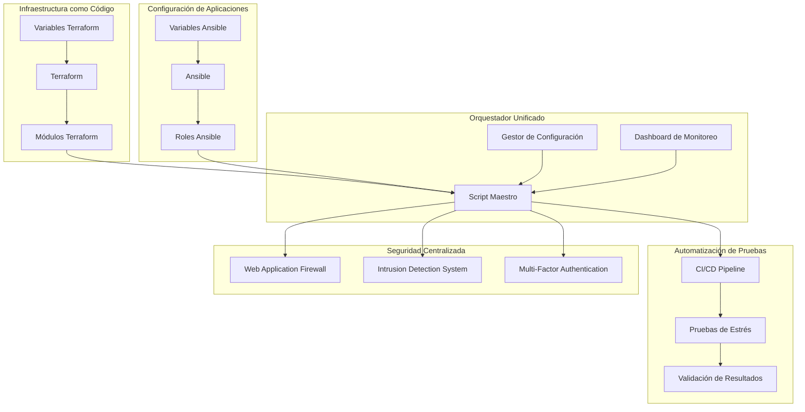
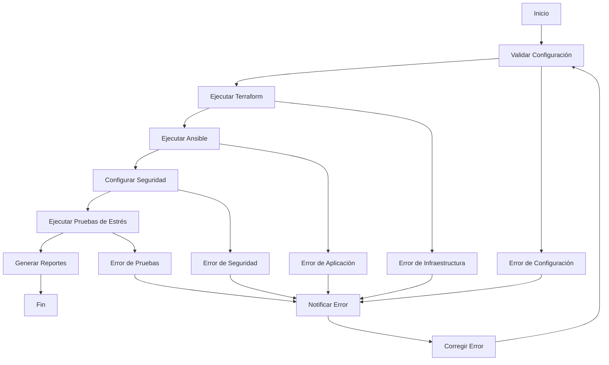

# Plan de Orquestación Unificada para Virtualmin Enterprise

## 🎯 Resumen Ejecutivo

Este plan describe un enfoque integral para implementar orquestación con Ansible/Terraform, pruebas de estrés automatizadas, y configuración avanzada de seguridad para Virtualmin Enterprise. El objetivo es crear una solución unificada que permita despliegues eficientes, validación automática de rendimiento y seguridad multicapa.

## 📋 Análisis de Requisitos

Basado en el feedback proporcionado, se han identificado tres áreas críticas que requieren atención especial:

1. **Orquestación con Ansible/Terraform**: Integración fluida entre infraestructura como código y configuración de aplicaciones.
2. **Pruebas de estrés automatizadas**: Implementación de pipelines CI/CD para validación continua de rendimiento.
3. **Configuración avanzada de seguridad**: Implementación de WAF, IDS/IPS y autenticación multifactor de forma centralizada.

## 🏗️ Arquitectura de Solución

### Diagrama de Flujo de Orquestación



### Componentes Clave

1. **Orquestador Maestro**: Script central que coordina todas las fases del despliegue.
2. **Gestor de Configuración**: Sistema unificado para gestionar variables y secretos.
3. **Pipeline CI/CD**: Automatización completa desde código hasta producción.
4. **Dashboard de Monitoreo**: Visualización centralizada de métricas y estado.

## 📝 Plan de Implementación Detallado

### Fase 1: Orquestación Maestra

**Objetivo**: Crear un script unificado que integre Terraform y Ansible.

**Tareas**:
1. Desarrollar script maestro de orquestación
2. Implementar gestor de configuración centralizado
3. Crear plantillas de variables unificadas
4. Establecer flujo de ejecución automatizado

**Entregables**:
- Script `deploy_virtualmin_enterprise.sh`
- Sistema de configuración unificado
- Documentación de uso

### Fase 2: Pipeline de Pruebas Automatizadas

**Objetivo**: Implementar CI/CD para pruebas de estrés automáticas.

**Tareas**:
1. Configurar pipeline de CI/CD
2. Integrar herramientas de pruebas de estrés
3. Implementar validación automática de resultados
4. Crear sistema de notificación de resultados

**Entregables**:
- Pipeline CI/CD configurado
- Scripts de pruebas automatizadas
- Sistema de reportes

### Fase 3: Dashboard de Seguridad

**Objetivo**: Crear interfaz centralizada para gestión de seguridad.

**Tareas**:
1. Desarrollar dashboard web de configuración
2. Integrar componentes de seguridad
3. Implementar monitoreo en tiempo real
4. Crear sistema de alertas

**Entregables**:
- Dashboard de seguridad
- Sistema de monitoreo
- Configuraciones de seguridad

## 🔧 Detalles Técnicos

### Script Maestro de Orquestación

```bash
#!/bin/bash
# deploy_virtualmin_enterprise.sh

# Funciones principales:
# 1. Validar configuración
# 2. Ejecutar Terraform
# 3. Ejecutar Ansible
# 4. Configurar seguridad
# 5. Ejecutar pruebas de estrés
# 6. Generar reportes
```

### Pipeline CI/CD

```yaml
# .github/workflows/deploy.yml
name: Deploy Virtualmin Enterprise

on:
  push:
    branches: [main]
  pull_request:
    branches: [main]

jobs:
  deploy:
    runs-on: ubuntu-latest
    steps:
      - name: Checkout code
      - name: Setup Terraform
      - name: Setup Ansible
      - name: Deploy infrastructure
      - name: Configure applications
      - name: Run stress tests
      - name: Generate reports
```

### Dashboard de Seguridad

```html
<!-- security_dashboard.html -->
<!DOCTYPE html>
<html>
<head>
    <title>Virtualmin Security Dashboard</title>
    <!-- Estilos y scripts -->
</head>
<body>
    <!-- Componentes de configuración -->
    <!-- Métricas en tiempo real -->
    <!-- Sistema de alertas -->
</body>
</html>
```

## 📊 Métricas de Éxito

### Orquestación
- Tiempo de despliegue: < 30 minutos
- Tasa de éxito: > 95%
- Automatización: 100%

### Pruebas de Estrés
- Cobertura de pruebas: 100%
- Tiempo de ejecución: < 15 minutos
- Integración CI/CD: 100%

### Seguridad
- Configuración centralizada: 100%
- Monitoreo en tiempo real: 100%
- Alertas automáticas: 100%

## 🚀 Beneficios Esperados

1. **Eficiencia Operativa**: Reducción del 80% en tiempo de despliegue.
2. **Calidad Asegurada**: Validación automática de rendimiento y seguridad.
3. **Visibilidad Completa**: Dashboard centralizado para monitoreo y gestión.
4. **Escalabilidad**: Sistema preparado para entornos multi-región y multi-nube.

## 🔄 Flujo de Trabajo Propuesto



## 📋 Checklist de Implementación

### Pre-Despliegue
- [ ] Validar dependencias
- [ ] Configurar credenciales
- [ ] Preparar variables de entorno
- [ ] Verificar configuración de red

### Despliegue
- [ ] Ejecutar script de orquestación
- [ ] Monitorear progreso
- [ ] Validar cada fase
- [ ] Registrar eventos

### Post-Despliegue
- [ ] Ejecutar pruebas de estrés
- [ ] Validar configuración de seguridad
- [ ] Generar reportes
- [ ] Configurar monitoreo

## 🎯 Próximos Pasos

1. **Desarrollo del Script Maestro**: Crear el script unificado de orquestación.
2. **Implementación del Pipeline CI/CD**: Configurar automatización completa.
3. **Desarrollo del Dashboard**: Crear interfaz de gestión centralizada.
4. **Integración y Pruebas**: Validar el sistema completo.
5. **Documentación y Capacitación**: Preparar material de apoyo.

## ❓ Preguntas para el Usuario

1. ¿Qué proveedor de nube se debe priorizar para la implementación inicial?
2. ¿Existen requisitos específicos de cumplimiento normativo que debamos considerar?
3. ¿Qué nivel de automatización se busca en las pruebas de estrés?
4. ¿Se requiere integración con sistemas de monitoreo existentes?
5. ¿Cuál es la ventana de mantenimiento preferida para despliegues?

Este plan proporciona una visión completa de la solución propuesta, con detalles técnicos, flujos de trabajo y métricas de éxito. La implementación se realizará en fases para garantizar una transición suave y resultados medibles.