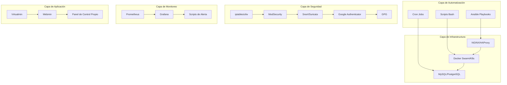

# Virtualmin Enterprise - Sistema Autoalojado

Este proyecto proporciona un sistema Virtualmin Enterprise completamente autoalojado, utilizando herramientas de código abierto y soluciones locales sin depender de servicios en la nube.

## Arquitectura del Sistema

El sistema está diseñado con múltiples capas para proporcionar una solución completa y autónoma:



## Componentes Implementados

### 1. Automatización y Orquestación ✅

- **Playbooks de Ansible**: Para instalación, configuración y actualización del sistema
- **Scripts Bash**: Para tareas específicas de automatización
- **Cron Jobs**: Para tareas programadas y mantenimiento

### 2. CI/CD y Validación Continua ✅

- **Git Hooks**: Para validación de código antes de commits
- **Jenkins Autoalojado**: Para pipelines CI/CD locales
- **Pruebas Automatizadas**: Unitarias, integración y validación de servicios

### 3. Seguridad Avanzada y Centralizada ✅

- **Firewall Local**: Configuración avanzada con iptables/ufw
- **WAF Open Source**: ModSecurity con reglas OWASP
- **Gestión de Seguridad**: Scripts para monitoreo y gestión de reglas

### 4. Autoescalado y Auto-recuperación ✅

- **Monitoreo de Recursos**: CPU, memoria, disco y carga del sistema
- **Acciones Automáticas**: Reinicio de servicios, limpieza de caché, etc.
- **Configuración Personalizable**: Umbrales y acciones configurables

## Estructura de Directorios

```
local_enterprise_automation/
├── install_virtualmin_enterprise.sh    # Script principal de instalación
├── auto_scaling_recovery.sh            # Script de autoescalado y recuperación
├── playbooks/                          # Playbooks de Ansible
│   ├── site.yml                        # Playbook principal
│   └── templates/                      # Plantillas de scripts
│       ├── backup.sh.j2                # Script de backup
│       ├── update.sh.j2                # Script de actualización
│       └── monitor.sh.j2               # Script de monitoreo
├── git_hooks/                          # Hooks de Git
│   └── pre-commit                      # Hook de pre-commit
├── security/                           # Scripts de seguridad
│   ├── configure_firewall.sh           # Configuración de firewall
│   └── setup_modsecurity.sh            # Configuración de ModSecurity
└── README.md                           # Este archivo
```

## Instalación

### Requisitos Previos

- Sistema operativo: Ubuntu 18.04+, Debian 9+, CentOS 7+, RHEL 7+
- Acceso root o sudo
- Conexión a Internet para la instalación inicial

### Pasos de Instalación

1. **Clonar el repositorio**:
   ```bash
   git clone https://github.com/virtualmin/virtualmin-enterprise.git
   cd virtualmin-enterprise/local_enterprise_automation
   ```

2. **Hacer ejecutable el script principal**:
   ```bash
   chmod +x install_virtualmin_enterprise.sh
   ```

3. **Ejecutar la instalación**:
   ```bash
   sudo ./install_virtualmin_enterprise.sh
   ```

4. **Seguir las instrucciones** del script de instalación

### Post-instalación

Después de la instalación, podrá acceder a los siguientes servicios:

- **Webmin**: https://<IP_DEL_SERVIDOR>:10000
- **Virtualmin**: https://<IP_DEL_SERVIDOR>:10000/virtualmin/
- **Grafana**: http://<IP_DEL_SERVIDOR>:3000 (admin/admin)
- **Prometheus**: http://<IP_DEL_SERVIDOR>:9090

## Configuración y Uso

### Automatización

#### Ansible Playbooks

Los playbooks de Ansible se encuentran en el directorio `playbooks/`:

```bash
# Ejecutar playbook principal
ansible-playbook playbooks/site.yml
```

#### Scripts de Automatización

Los scripts se encuentran en el directorio `/opt/virtualmin-enterprise/scripts/`:

```bash
# Ejecutar backup
/opt/virtualmin-enterprise/scripts/backup.sh

# Ejecutar actualización
/opt/virtualmin-enterprise/scripts/update.sh

# Ejecutar monitoreo
/opt/virtualmin-enterprise/scripts/monitor.sh
```

#### Autoescalado y Recuperación

El script de autoescalado y recuperación se configura automáticamente:

```bash
# Configurar autoescalado
/opt/virtualmin-enterprise/scripts/auto_scaling_recovery.sh

# Verificar configuración
cat /opt/virtualmin-enterprise/config/auto_scaling.conf
```

### Seguridad

#### Firewall

Para configurar el firewall:

```bash
# Ejecutar script de configuración
sudo ./security/configure_firewall.sh

# Gestionar reglas
/opt/virtualmin-enterprise/config/firewall/security-rules.sh block_ip <IP> <RAZÓN>
/opt/virtualmin-enterprise/config/firewall/security-rules.sh allow_ip <IP> <RAZÓN>
/opt/virtualmin-enterprise/config/firewall/security-rules.sh unblock_ip <IP>
/opt/virtualmin-enterprise/config/firewall/security-rules.sh list_blocked_ips
```

#### ModSecurity WAF

Para configurar ModSecurity:

```bash
# Ejecutar script de instalación
sudo ./security/setup_modsecurity.sh

# Gestionar ModSecurity
/opt/virtualmin-enterprise/scripts/manage_modsecurity.sh check_status
/opt/virtualmin-enterprise/scripts/manage_modsecurity.sh enable
/opt/virtualmin-enterprise/scripts/manage_modsecurity.sh disable
/opt/virtualmin-enterprise/scripts/manage_modsecurity.sh view_logs
```

### CI/CD

#### Git Hooks

Los hooks de Git se instalan automáticamente al clonar el repositorio:

```bash
# Verificar hooks instalados
ls -la .git/hooks/

# Ejecutar validaciones manualmente
.git/hooks/pre-commit
```

#### Jenkins

Para configurar Jenkins:

```bash
# Ejecutar script de instalación
sudo ./setup_jenkins.sh

# Acceder a Jenkins
# URL: http://<IP_DEL_SERVIDOR>:8080
# Usuario: admin
# Contraseña: Ver /var/lib/jenkins/secrets/initialAdminPassword
```

## Monitoreo y Mantenimiento

### Monitoreo de Recursos

El sistema incluye monitoreo automático de recursos:

- **Uso de CPU**: Alerta si supera el 80%
- **Uso de Memoria**: Alerta si supera el 80%
- **Espacio en Disco**: Alerta si supera el 80%
- **Carga del Sistema**: Alerta si supera 2.0 por CPU

### Logs

Los logs del sistema se almacenan en:

- **Logs de Instalación**: `/var/log/virtualmin-enterprise-install.log`
- **Logs de Autoescalado**: `/var/log/virtualmin-enterprise-auto-scaling.log`
- **Logs de Firewall**: `/var/log/virtualmin-enterprise-firewall.log`
- **Logs de Monitoreo**: `/var/log/virtualmin-enterprise-monitor.log`

### Backups

Los backups se generan automáticamente y se almacenan en:

- **Directorio de Backups**: `/opt/virtualmin-enterprise/backups/`
- **Frecuencia**: Diarios a las 2 AM
- **Retención**: 7 días

## Personalización

### Configuración de Umbrales

Para personalizar los umbrales de autoescalado:

```bash
# Editar archivo de configuración
nano /opt/virtualmin-enterprise/config/auto_scaling.conf

# Reiniciar servicio
systemctl restart virtualmin-auto-scaling
```

### Configuración de Alertas

Para personalizar las alertas:

```bash
# Editar script de monitoreo
nano /opt/virtualmin-enterprise/scripts/monitor.sh

# Añadir método de notificación (email, Telegram, etc.)
```

## Solución de Problemas

### Problemas Comunes

#### Virtualmin no es accesible

```bash
# Verificar estado del servicio
systemctl status webmin

# Reiniciar servicio
systemctl restart webmin

# Verificar logs
tail -f /var/webmin/miniserv.log
```

#### ModSecurity bloquea solicitudes legítimas

```bash
# Verificar logs de ModSecurity
tail -f /opt/virtualmin-enterprise/logs/modsec_audit.log

# Excluir regla problemática
/opt/virtualmin-enterprise/scripts/manage_modsecurity.sh exclude_rule <ID_REGLA>
```

#### Autoescalado no funciona

```bash
# Verificar estado del servicio
systemctl status virtualmin-auto-scaling

# Verificar configuración
cat /opt/virtualmin-enterprise/config/auto_scaling.conf

# Verificar logs
tail -f /var/log/virtualmin-enterprise-auto-scaling.log
```

## Contribución

Para contribuir al proyecto:

1. Fork el repositorio
2. Cree una rama de características
3. Realice sus cambios
4. Ejecute las validaciones (pre-commit)
5. Envíe un pull request

## Licencia

Este proyecto está licenciado bajo la Licencia Pública General de GNU v3.0.

## Soporte

Para soporte y preguntas:

- **Documentación**: Consulte los archivos README.md en cada componente
- **Issues**: Abra un issue en el repositorio de GitHub
- **Comunidad**: Únase a nuestro foro de la comunidad

## Roadmap

### Próximas Versiones

- **v1.1**: Implementación de IDS/IPS local (Snort, Suricata)
- **v1.2**: Autenticación multifactor local (Google Authenticator PAM)
- **v1.3**: Gestión de secretos con GPG
- **v1.4**: Sistema de hardening automático
- **v1.5**: Cifrado de discos con LUKS

### Funcionalidades Futuras

- Panel de control web propio
- Balanceadores de carga locales
- Clústeres con Docker Swarm/Kubernetes
- Replicación y failover de bases de datos
- Sistema de alertas avanzado