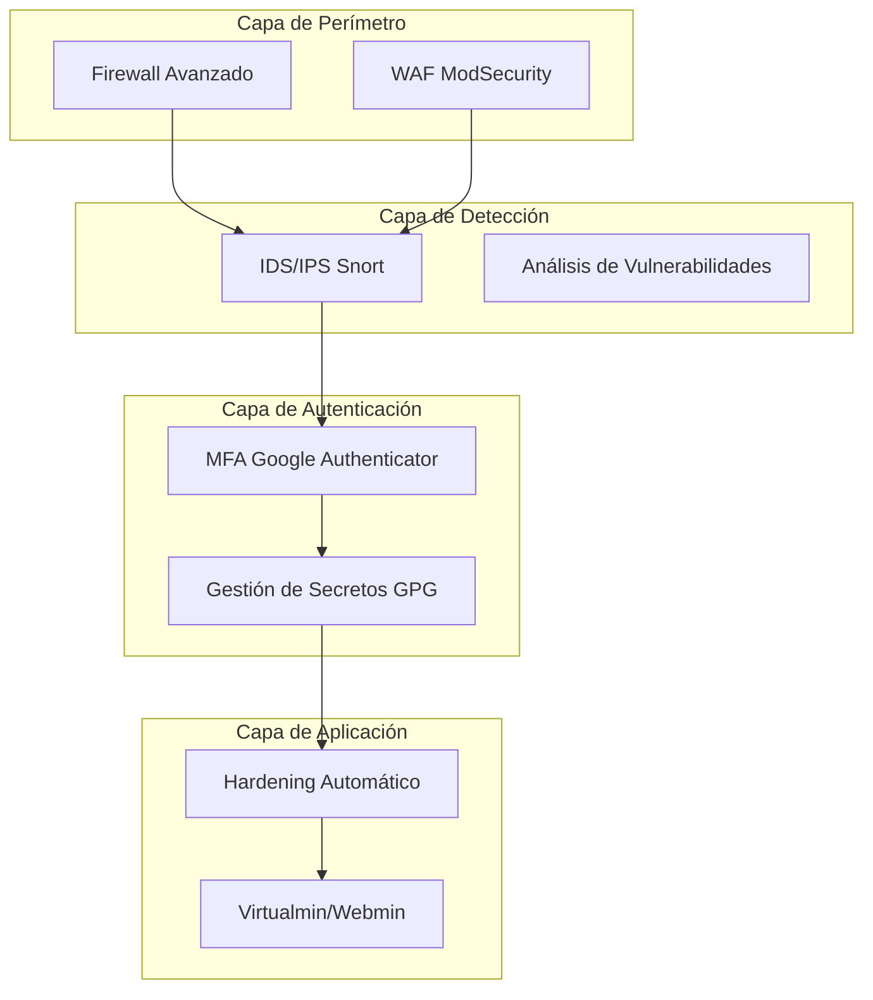

# Guía de Componentes de Seguridad para Virtualmin Enterprise

Esta guía describe los componentes de seguridad implementados en el sistema Virtualmin Enterprise autoalojado.

## Componentes Implementados

### 1. Firewall Avanzado ✅

#### Configuración
- **Script de instalación**: `security/configure_firewall.sh`
- **Configuración**: `/opt/virtualmin-enterprise/config/firewall/`
- **Logs**: `/var/log/virtualmin-enterprise-firewall.log`

#### Características
- Configuración automática de iptables/ufw/firewalld
- Reglas personalizadas para servicios Webmin, Virtualmin, SSH, HTTP/HTTPS
- Protección contra ataques comunes (SYN flood, escaneo de puertos, fuerza bruta)
- Gestión de IPs bloqueadas/permitidas
- Monitoreo y generación de informes

#### Uso
```bash
# Instalar y configurar firewall
sudo ./security/configure_firewall.sh

# Gestionar reglas
/opt/virtualmin-enterprise/config/firewall/security-rules.sh block_ip <IP> <RAZÓN>
/opt/virtualmin-enterprise/config/firewall/security-rules.sh allow_ip <IP> <RAZÓN>
/opt/virtualmin-enterprise/config/firewall/security-rules.sh unblock_ip <IP>
/opt/virtualmin-enterprise/config/firewall/security-rules.sh list_blocked_ips
```

### 2. WAF (Web Application Firewall) ✅

#### Configuración
- **Script de instalación**: `security/setup_modsecurity.sh`
- **Configuración**: `/etc/modsecurity/`
- **Reglas**: `/etc/modsecurity/crs/`
- **Logs**: `/opt/virtualmin-enterprise/logs/modsec_audit.log`

#### Características
- ModSecurity con reglas OWASP CRS
- Protección contra inyección SQL, XSS, ataques de inyección de código
- Exclusión de reglas problemáticas para Virtualmin
- Actualización automática de reglas
- Gestión de reglas personalizadas

#### Uso
```bash
# Instalar y configurar ModSecurity
sudo ./security/setup_modsecurity.sh

# Gestionar ModSecurity
/opt/virtualmin-enterprise/scripts/manage_modsecurity.sh check_status
/opt/virtualmin-enterprise/scripts/manage_modsecurity.sh enable
/opt/virtualmin-enterprise/scripts/manage_modsecurity.sh disable
/opt/virtualmin-enterprise/scripts/manage_modsecurity.sh view_logs
/opt/virtualmin-enterprise/scripts/manage_modsecurity.sh exclude_rule <ID_REGLA>
/opt/virtualmin-enterprise/scripts/manage_modsecurity.sh update_crs
```

### 3. IDS/IPS (Sistema de Detección/Prevención de Intrusiones) ✅

#### Configuración
- **Script de instalación**: `security/setup_snort.sh`
- **Configuración**: `/etc/snort/`
- **Reglas**: `/etc/snort/rules/`
- **Logs**: `/var/log/snort/`

#### Características
- Snort IDS/IPS con reglas comunitarias
- Detección de intentos de acceso no autorizados
- Detección de ataques de fuerza bruta
- Detección de escaneo de puertos
- Detección de inyección SQL y XSS
- Modo IDS (detección) y IPS (prevención)
- Actualización automática de reglas

#### Uso
```bash
# Instalar y configurar Snort
sudo ./security/setup_snort.sh

# Gestionar Snort
/opt/virtualmin-enterprise/scripts/manage_snort.sh check_status
/opt/virtualmin-enterprise/scripts/manage_snort.sh start_ids
/opt/virtualmin-enterprise/scripts/manage_snort.sh stop_ids
/opt/virtualmin-enterprise/scripts/manage_snort.sh restart_ids
/opt/virtualmin-enterprise/scripts/manage_snort.sh start_ips
/opt/virtualmin-enterprise/scripts/manage_snort.sh stop_ips
/opt/virtualmin-enterprise/scripts/manage_snort.sh restart_ips
/opt/virtualmin-enterprise/scripts/manage_snort.sh update_rules
/opt/virtualmin-enterprise/scripts/manage_snort.sh view_alerts
/opt/virtualmin-enterprise/scripts/manage_snort.sh add_local_rule <REGLA>
/opt/virtualmin-enterprise/scripts/manage_snort.sh remove_local_rule <SID>
/opt/virtualmin-enterprise/scripts/manage_snort.sh generate_alert_report
```

### 4. Autenticación Multifactor (MFA) ✅

#### Configuración
- **Script de instalación**: `security/setup_google_authenticator.sh`
- **Configuración**: `/etc/pam.d/`
- **Códigos QR**: `/opt/virtualmin-enterprise/config/mfa/`
- **Logs**: `/var/log/virtualmin-enterprise-mfa.log`

#### Características
- Google Authenticator PAM para SSH, Webmin y Virtualmin
- Códigos QR para configuración fácil
- Códigos de recuperación
- Gestión de usuarios MFA
- Verificación de códigos TOTP

#### Uso
```bash
# Instalar y configurar Google Authenticator
sudo ./security/setup_google_authenticator.sh

# Configurar MFA para usuarios existentes
/opt/virtualmin-enterprise/config/mfa/setup_initial_mfa.sh

# Gestionar MFA
/opt/virtualmin-enterprise/scripts/manage_mfa.sh setup_user_mfa <USUARIO>
/opt/virtualmin-enterprise/scripts/manage_mfa.sh disable_user_mfa <USUARIO>
/opt/virtualmin-enterprise/scripts/manage_mfa.sh generate_qr_code <USUARIO>
/opt/virtualmin-enterprise/scripts/manage_mfa.sh verify_code <USUARIO> <CÓDIGO>
/opt/virtualmin-enterprise/scripts/manage_mfa.sh regenerate_user_mfa <USUARIO>
/opt/virtualmin-enterprise/scripts/manage_mfa.sh show_recovery_codes <USUARIO>
/opt/virtualmin-enterprise/scripts/manage_mfa.sh show_user_mfa_status <USUARIO>
```

### 5. Gestión de Secretos Cifrados ✅

#### Configuración
- **Script de instalación**: `security/setup_gpg_secrets.sh`
- **Configuración**: `/opt/virtualmin-enterprise/config/secrets/`
- **Secretos**: `/opt/virtualmin-enterprise/secrets/`
- **Logs**: `/var/log/virtualmin-enterprise-gpg.log`

#### Características
- GPG para cifrado de secretos
- Generación de contraseñas seguras
- Generación de secretos aleatorios
- Importación/exportación de secretos
- Integración con Virtualmin
- Backup automático de secretos

#### Uso
```bash
# Instalar y configurar gestión de secretos
sudo ./security/setup_gpg_secrets.sh

# Gestionar secretos
/opt/virtualmin-enterprise/scripts/manage_secrets.sh encrypt_secret <NOMBRE> <VALOR>
/opt/virtualmin-enterprise/scripts/manage_secrets.sh decrypt_secret <NOMBRE>
/opt/virtualmin-enterprise/scripts/manage_secrets.sh list_secrets
/opt/virtualmin-enterprise/scripts/manage_secrets.sh delete_secret <NOMBRE>
/opt/virtualmin-enterprise/scripts/manage_secrets.sh rename_secret <NOMBRE_ANTIGUO> <NOMBRE_NUEVO>
/opt/virtualmin-enterprise/scripts/manage_secrets.sh export_secret <NOMBRE> <ARCHIVO>
/opt/virtualmin-enterprise/scripts/manage_secrets.sh import_secret <NOMBRE> <ARCHIVO>
/opt/virtualmin-enterprise/scripts/manage_secrets.sh generate_random_secret <NOMBRE> [LONGITUD]
/opt/virtualmin-enterprise/scripts/manage_secrets.sh generate_secure_password <NOMBRE> [LONGITUD]
/opt/virtualmin-enterprise/scripts/manage_secrets.sh backup_secrets [DIRECTORIO]
/opt/virtualmin-enterprise/scripts/manage_secrets.sh restore_secrets <DIRECTORIO>

# Integración con Virtualmin
/opt/virtualmin-enterprise/scripts/integrate_secrets_virtualmin.sh setup_database_password <DOMINIO>
/opt/virtualmin-enterprise/scripts/integrate_secrets_virtualmin.sh setup_api_key <DOMINIO>
/opt/virtualmin-enterprise/scripts/integrate_secrets_virtualmin.sh setup_ssl_certificate <DOMINIO>
/opt/virtualmin-enterprise/scripts/integrate_secrets_virtualmin.sh setup_domain_secrets <DOMINIO>
```

### 6. Sistema de Hardening Automático ✅

#### Configuración
- **Script de instalación**: `security/setup_hardening.sh`
- **Configuración**: `/opt/virtualmin-enterprise/config/hardening/`
- **Informes**: `/opt/virtualmin-enterprise/reports/security/`
- **Logs**: `/var/log/virtualmin-enterprise-hardening.log`

#### Características
- OpenVAS para análisis de vulnerabilidades
- Lynis para auditoría de seguridad
- chkrootkit para detección de rootkits
- rkhunter para detección de rootkits
- Generación de informes de seguridad
- Ejecución programada de análisis

#### Uso
```bash
# Instalar y configurar sistema de hardening
sudo ./security/setup_hardening.sh

# Gestionar hardening
/opt/virtualmin-enterprise/scripts/manage_hardening.sh run_lynis_audit [TIPO]
/opt/virtualmin-enterprise/scripts/manage_hardening.sh run_openvas_scan [OBJETIVO] [NOMBRE]
/opt/virtualmin-enterprise/scripts/manage_hardening.sh run_chkrootkit_scan
/opt/virtualmin-enterprise/scripts/manage_hardening.sh run_rkhunter_scan
/opt/virtualmin-enterprise/scripts/manage_hardening.sh run_nikto_scan [URL]
/opt/virtualmin-enterprise/scripts/manage_hardening.sh run_nmap_scan [OBJETIVO]
/opt/virtualmin-enterprise/scripts/manage_hardening.sh generate_security_report
```

## Arquitectura de Seguridad



## Flujo de Seguridad

1. **Perímetro**: Firewall y WAF bloquean tráfico malicioso
2. **Detección**: IDS/IPS detecta y previene intrusiones
3. **Autenticación**: MFA y gestión de secretos aseguran el acceso
4. **Aplicación**: Hardening automático mantiene la seguridad

## Tareas Programadas

El sistema incluye las siguientes tareas programadas:

- **Diariamente (3 AM)**: Backup de secretos cifrados
- **Diariamente (2 AM)**: Análisis con chkrootkit
- **Semanalmente**: Análisis con rkhunter
- **Mensualmente**: Auditoría completa con Lynis
- **Trimestralmente**: Análisis de vulnerabilidades con OpenVAS

## Recomendaciones de Seguridad

1. **Configurar MFA** para todos los usuarios con acceso administrativo
2. **Rotar secretos** regularmente (cada 90 días)
3. **Revisar logs** de seguridad periódicamente
4. **Actualizar reglas** de seguridad regularmente
5. **Realizar auditorías** de seguridad completas trimestralmente
6. **Implementar monitoreo** de alertas de seguridad
7. **Documentar incidentes** de seguridad y respuestas

## Solución de Problemas

### Problemas Comunes

#### Firewall bloqueando acceso legítimo
```bash
# Verificar reglas de firewall
/opt/virtualmin-enterprise/config/firewall/security-rules.sh list_blocked_ips

# Permitir IP específica
/opt/virtualmin-enterprise/config/firewall/security-rules.sh allow_ip <IP> <RAZÓN>
```

#### ModSecurity bloqueando solicitudes legítimas
```bash
# Verificar logs de ModSecurity
/opt/virtualmin-enterprise/scripts/manage_modsecurity.sh view_logs

# Excluir regla problemática
/opt/virtualmin-enterprise/scripts/manage_modsecurity.sh exclude_rule <ID_REGLA>
```

#### Snort generando falsos positivos
```bash
# Verificar alertas de Snort
/opt/virtualmin-enterprise/scripts/manage_snort.sh view_alerts

# Modificar regla local
/opt/virtualmin-enterprise/scripts/manage_snort.sh remove_local_rule <SID>
/opt/virtualmin-enterprise/scripts/manage_snort.sh add_local_rule <REGLA_MODIFICADA>
```

#### Problemas con MFA
```bash
# Verificar estado de MFA
/opt/virtualmin-enterprise/scripts/manage_mfa.sh show_user_mfa_status <USUARIO>

# Regenerar secretos MFA
/opt/virtualmin-enterprise/scripts/manage_mfa.sh regenerate_user_mfa <USUARIO>
```

## Integración con Virtualmin

Todos los componentes de seguridad están diseñados para integrarse perfectamente con Virtualmin Enterprise:

- **Firewall**: Reglas personalizadas para puertos de Virtualmin/Webmin
- **WAF**: Exclusión de reglas problemáticas para Virtualmin
- **IDS/IPS**: Reglas específicas para detección de ataques a Virtualmin
- **MFA**: Integración con PAM de SSH, Webmin y Virtualmin
- **Secretos**: Scripts para gestión automática de contraseñas de bases de datos y certificados SSL
- **Hardening**: Auditoría específica de configuraciones de Virtualmin

## Conclusiones

El sistema de seguridad implementado proporciona una protección multicapa completa para Virtualmin Enterprise:

1. **Protección de perímetro** con firewall y WAF
2. **Detección y prevención** de intrusiones
3. **Autenticación fuerte** con MFA y gestión de secretos
4. **Hardening automático** con auditorías continuas

Todos los componentes son de código abierto, autoalojados y completamente gestionables a través de scripts personalizados, proporcionando una solución de seguridad independiente sin dependencias de servicios en la nube.